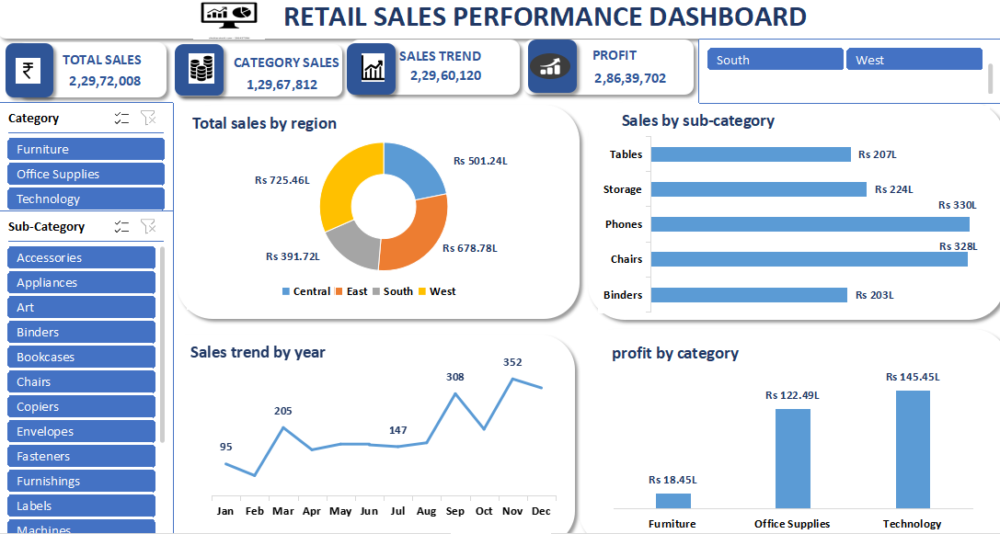

# Retail Sales Analysis Dashboard (Excel)

## Objective
Analyze sales performance and trends.

## Tools Used
- Excel

## Features
- KPI metrics
- Monthly sales trends
- Product performance analysis

 ## Insights
- Sales performance peaked during certain months
- A few product categories contributed the highest revenue
- Regional analysis shows variation in sales performance

## Dashboard Preview

